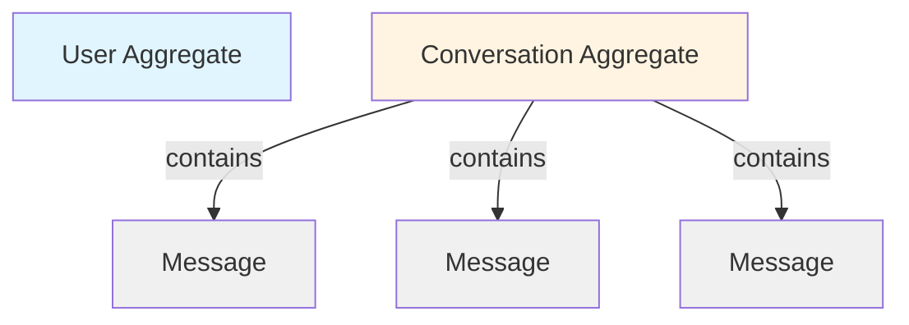

## Introduction

The domain model is the heart of the TelegrmBot application. It encapsulates the business rules and ensures data integrity through entities and value objects that are **framework-agnostic** and **technology-independent**.

<Info>
  All domain classes are located in `src/main/java/com/acamus/telegrm/core/domain/` and contain zero Spring or JPA annotations.
</Info>

## Domain Entities

Entities are objects with a unique identity that persists over time. They encapsulate state and behavior related to business concepts.

### User Entity

Represents authenticated users who can access the API and manage conversations.

```java
// src/main/java/com/acamus/telegrm/core/domain/model/User.java
package com.acamus.telegrm.core.domain.model;

import com.acamus.telegrm.core.domain.valueobjects.Email;
import com.acamus.telegrm.core.domain.valueobjects.Password;
import java.time.LocalDateTime;
import java.util.UUID;

public class User {
    private String id;
    private Email email;
    private Password password;
    private String name;
    private boolean enabled;
    private LocalDateTime createdAt;
    private LocalDateTime lastLoginAt;

    private User() {}

    // Factory method for creating new users
    public static User create(String name, Email email, Password password) {
        User user = new User();
        user.id = UUID.randomUUID().toString();
        user.name = name;
        user.email = Objects.requireNonNull(email);
        user.password = Objects.requireNonNull(password);
        user.enabled = true;
        user.createdAt = LocalDateTime.now();
        return user;
    }

    // Factory method for reconstruction from repository
    public static User reconstruct(String id, String name, Email email, 
                                   Password password, boolean enabled, 
                                   LocalDateTime createdAt, 
                                   LocalDateTime lastLoginAt) {
        User user = new User();
        user.id = Objects.requireNonNull(id);
        user.name = name;
        user.email = Objects.requireNonNull(email);
        user.password = Objects.requireNonNull(password);
        user.enabled = enabled;
        user.createdAt = Objects.requireNonNull(createdAt);
        user.lastLoginAt = lastLoginAt;
        return user;
    }

    // Getters...
    public String getId() { return id; }
    public Email getEmail() { return email; }
    public Password getPassword() { return password; }
    public String getName() { return name; }
    public boolean isEnabled() { return enabled; }
    public LocalDateTime getCreatedAt() { return createdAt; }
    public LocalDateTime getLastLoginAt() { return lastLoginAt; }
}
```

<Accordion title="Design Patterns Used">
  **Private Constructor + Factory Methods**
  
  - Constructor is private to prevent invalid object creation
  - `create()` - For new entities (generates ID, sets timestamps)
  - `reconstruct()` - For entities loaded from persistence (preserves existing ID)
  
  This pattern ensures entities are always created in a valid state.
</Accordion>

<Note>
  Notice the use of **Value Objects** (`Email` and `Password`) instead of primitive types. This ensures validation and encapsulates business rules.
</Note>

### Conversation Entity

Represents a chat session between the Telegram bot and a Telegram user.

```java
// src/main/java/com/acamus/telegrm/core/domain/model/Conversation.java
package com.acamus.telegrm.core.domain.model;

import com.acamus.telegrm.core.domain.valueobjects.TelegramChatId;
import java.time.LocalDateTime;
import java.util.UUID;

public class Conversation {
    private String id;
    private TelegramChatId telegramChatId;
    private String firstName;
    private String lastName;
    private String username;
    private LocalDateTime createdAt;
    private LocalDateTime lastMessageAt;

    private Conversation() {}

    public static Conversation create(TelegramChatId telegramChatId, 
                                      String firstName, 
                                      String lastName, 
                                      String username) {
        Conversation conv = new Conversation();
        conv.id = UUID.randomUUID().toString();
        conv.telegramChatId = Objects.requireNonNull(telegramChatId);
        conv.firstName = firstName;
        conv.lastName = lastName;
        conv.username = username;
        conv.createdAt = LocalDateTime.now();
        conv.lastMessageAt = LocalDateTime.now();
        return conv;
    }

    // Business method
    public void updateLastMessageAt() {
        this.lastMessageAt = LocalDateTime.now();
    }

    public static Conversation reconstruct(String id, 
                                          TelegramChatId telegramChatId, 
                                          String firstName, 
                                          String lastName, 
                                          String username, 
                                          LocalDateTime createdAt, 
                                          LocalDateTime lastMessageAt) {
        Conversation conv = new Conversation();
        conv.id = id;
        conv.telegramChatId = telegramChatId;
        conv.firstName = firstName;
        conv.lastName = lastName;
        conv.username = username;
        conv.createdAt = createdAt;
        conv.lastMessageAt = lastMessageAt;
        return conv;
    }

    // Getters...
    public String getId() { return id; }
    public TelegramChatId getTelegramChatId() { return telegramChatId; }
    public String getFirstName() { return firstName; }
    public String getLastName() { return lastName; }
    public String getUsername() { return username; }
    public LocalDateTime getCreatedAt() { return createdAt; }
    public LocalDateTime getLastMessageAt() { return lastMessageAt; }
}
```

<Tip>
  The `updateLastMessageAt()` method is a **business rule**. By encapsulating this logic in the entity, we prevent external code from incorrectly manipulating the timestamp.
</Tip>

### Message Entity

Represents individual messages within a conversation, tracking direction (incoming from user vs outgoing from bot).

```java
// src/main/java/com/acamus/telegrm/core/domain/model/Message.java
package com.acamus.telegrm.core.domain.model;

import com.acamus.telegrm.core.domain.valueobjects.MessageContent;
import java.time.LocalDateTime;
import java.util.UUID;

public class Message {
    private String id;
    private String conversationId;
    private MessageContent content;
    private MessageDirection direction;
    private LocalDateTime sentAt;

    private Message() {}

    public static Message createIncoming(String conversationId, 
                                        MessageContent content) {
        return create(conversationId, content, MessageDirection.INCOMING);
    }

    public static Message createOutgoing(String conversationId, 
                                        MessageContent content) {
        return create(conversationId, content, MessageDirection.OUTGOING);
    }

    private static Message create(String conversationId, 
                                 MessageContent content, 
                                 MessageDirection direction) {
        Message msg = new Message();
        msg.id = UUID.randomUUID().toString();
        msg.conversationId = Objects.requireNonNull(conversationId);
        msg.content = Objects.requireNonNull(content);
        msg.direction = Objects.requireNonNull(direction);
        msg.sentAt = LocalDateTime.now();
        return msg;
    }
    
    public static Message reconstruct(String id, 
                                     String conversationId, 
                                     MessageContent content, 
                                     MessageDirection direction, 
                                     LocalDateTime sentAt) {
        Message msg = new Message();
        msg.id = id;
        msg.conversationId = conversationId;
        msg.content = content;
        msg.direction = direction;
        msg.sentAt = sentAt;
        return msg;
    }

    public enum MessageDirection {
        INCOMING, OUTGOING
    }

    // Getters...
    public String getId() { return id; }
    public String getConversationId() { return conversationId; }
    public MessageContent getContent() { return content; }
    public MessageDirection getDirection() { return direction; }
    public LocalDateTime getSentAt() { return sentAt; }
}
```

<Accordion title="Factory Methods Pattern">
  Notice the specialized factory methods:
  - `createIncoming()` - For user messages
  - `createOutgoing()` - For bot responses
  
  This makes the intent explicit and prevents direction confusion.
</Accordion>

## Value Objects

Value objects are **immutable** objects defined by their attributes rather than identity. They encapsulate validation logic and ensure data integrity.

<CardGroup cols={2}>
  <Card title="Why Value Objects?" icon="shield-check">
    - Encapsulate validation logic
    - Make impossible states impossible
    - Self-documenting code
    - Type safety beyond primitives
  </Card>
  <Card title="Characteristics" icon="list-check">
    - Immutable (Java records are perfect)
    - No identity (equality by value)
    - Validate at construction
    - Cannot be invalid
  </Card>
</CardGroup>

### Email Value Object

Ensures only valid email addresses exist in the system.

```java
// src/main/java/com/acamus/telegrm/core/domain/valueobjects/Email.java
package com.acamus.telegrm.core.domain.valueobjects;

import java.util.regex.Pattern;

public record Email(String value) {

    private static final Pattern EMAIL_PATTERN =
        Pattern.compile("^[A-Za-z0-9+_.-]+@([A-Za-z0-9.-]+\\.[A-Za-z]{2,})$");

    public Email {
        Objects.requireNonNull(value, "Email cannot be null");
        if (value.isBlank()) {
            throw new IllegalArgumentException("Email cannot be blank");
        }
        if (!EMAIL_PATTERN.matcher(value).matches()) {
            throw new IllegalArgumentException("Invalid email format: " + value);
        }
        value = value.trim();
    }
}
```

**Usage:**
```java
// This will compile and run
Email validEmail = new Email("user@example.com");

// This will throw IllegalArgumentException at construction
Email invalidEmail = new Email("not-an-email");
```

<Info>
  Java records provide automatic immutability, `equals()`, `hashCode()`, and `toString()` implementations. The compact constructor syntax allows validation logic.
</Info>

### Password Value Object

Encapsulates password constraints.

```java
// src/main/java/com/acamus/telegrm/core/domain/valueobjects/Password.java
package com.acamus.telegrm.core.domain.valueobjects;

public record Password(String value) {
    public Password {
        Objects.requireNonNull(value, "Password cannot be null");
        if (value.isBlank()) {
            throw new IllegalArgumentException("Password cannot be blank");
        }
    }
}
```

<Note>
  In this implementation, the password is already hashed before being wrapped in the value object. Additional validation rules (length, complexity) could be added here.
</Note>

### TelegramChatId Value Object

Type-safe wrapper for Telegram chat identifiers.

```java
// src/main/java/com/acamus/telegrm/core/domain/valueobjects/TelegramChatId.java
package com.acamus.telegrm.core.domain.valueobjects;

public record TelegramChatId(Long value) {
    public TelegramChatId {
        Objects.requireNonNull(value, "Telegram Chat ID cannot be null");
    }
}
```

<Tip>
  Using `TelegramChatId` instead of `Long` prevents mixing up chat IDs with other Long values (user IDs, message IDs, etc.). The compiler enforces type safety.
</Tip>

### MessageContent Value Object

Enforces Telegram's message length constraint.

```java
// src/main/java/com/acamus/telegrm/core/domain/valueobjects/MessageContent.java
package com.acamus.telegrm.core.domain.valueobjects;

public record MessageContent(String value) {
    private static final int MAX_LENGTH = 4096; // Telegram's limit

    public MessageContent {
        Objects.requireNonNull(value, "Message content cannot be null");
        if (value.isBlank()) {
            throw new IllegalArgumentException("Message content cannot be blank");
        }
        if (value.length() > MAX_LENGTH) {
            throw new IllegalArgumentException(
                "Message content exceeds max length of " + MAX_LENGTH
            );
        }
    }
}
```

<Info>
  This value object enforces Telegram's 4096 character limit at the domain level, catching violations early before attempting to send to the API.
</Info>

## Aggregates and Relationships

In Domain-Driven Design, **aggregates** are clusters of objects treated as a single unit.



### Conversation as Aggregate Root

`Conversation` is an aggregate root that manages its messages:

- Messages are accessed **through** the conversation
- Conversation ID is the foreign key in messages
- Conversation enforces invariants (e.g., updating `lastMessageAt`)

<Accordion title="Why Not a Messages Collection?">
  You might wonder why `Conversation` doesn't have a `List<Message>` field.
  
  **Answer**: In hexagonal architecture with repository pattern, we keep aggregates small:
  - Avoids loading all messages into memory
  - Messages are retrieved via `MessageRepositoryPort.findByConversationId()`
  - Better performance and scalability
  
  The relationship exists logically, not as an in-memory collection.
</Accordion>

## Business Rules and Invariants

Domain models enforce business rules through encapsulation:

<CardGroup cols={2}>
  <Card title="User Rules" icon="user">
    - ID is auto-generated (UUID)
    - Email must be valid format
    - Password cannot be blank
    - New users are enabled by default
    - Created timestamp is automatic
  </Card>
  
  <Card title="Conversation Rules" icon="comments">
    - Telegram chat ID is required
    - Timestamps are auto-managed
    - Last message time updates on activity
    - Can have optional user metadata
  </Card>
  
  <Card title="Message Rules" icon="message">
    - Must belong to a conversation
    - Direction must be specified
    - Content must respect Telegram limits
    - Sent timestamp is automatic
  </Card>
  
  <Card title="Value Object Rules" icon="shield">
    - Email: regex validation
    - Password: non-empty
    - MessageContent: length ≤ 4096
    - All: immutable after creation
  </Card>
</CardGroup>

## Domain Exceptions

Custom exceptions express business rule violations:

```java
// src/main/java/com/acamus/telegrm/core/domain/exception/
public class EmailAlreadyExistsException extends RuntimeException {
    public EmailAlreadyExistsException(String email) {
        super("User with email " + email + " already exists");
    }
}

public class InvalidCredentialsException extends RuntimeException {
    public InvalidCredentialsException() {
        super("Invalid email or password");
    }
}
```

<Note>
  Domain exceptions are in the **core layer**, making them independent of infrastructure. They express business failures, not technical failures.
</Note>

## Benefits of This Domain Model

<CardGroup cols={2}>
  <Card title="Type Safety" icon="shield-halved">
    Value objects prevent primitive obsession
    ```java
    // Bad: Easy to mix up
    void send(Long chatId, String text)
    
    // Good: Compiler prevents mistakes
    void send(TelegramChatId chatId, MessageContent text)
    ```
  </Card>
  
  <Card title="Always Valid" icon="check-double">
    Invalid objects cannot be constructed
    ```java
    // Impossible to create invalid email
    Email email = new Email("invalid");
    // Throws IllegalArgumentException
    ```
  </Card>
  
  <Card title="Self-Documenting" icon="book">
    Types reveal intent
    ```java
    // What does this accept?
    User user = new User(String, String, String);
    
    // Crystal clear
    User user = User.create(name, email, password);
    ```
  </Card>
  
  <Card title="Testable" icon="flask-vial">
    Pure domain logic, easy to test
    ```java
    @Test
    void shouldRejectInvalidEmail() {
        assertThrows(IllegalArgumentException.class, 
            () -> new Email("not-valid"));
    }
    ```
  </Card>
</CardGroup>

## Package Structure

```
core/domain/
├── model/
│   ├── User.java              # User aggregate root
│   ├── Conversation.java      # Conversation aggregate root
│   ├── Message.java           # Message entity
│   └── TelegramChat.java      # (deprecated/empty)
│
├── valueobjects/
│   ├── Email.java             # Email with validation
│   ├── Password.java          # Password wrapper
│   ├── TelegramChatId.java    # Type-safe chat ID
│   └── MessageContent.java    # Content with length limit
│
└── exception/
    ├── EmailAlreadyExistsException.java
    └── InvalidCredentialsException.java
```

## Key Takeaways

1. **Entities Have Identity**: `User`, `Conversation`, `Message` are identified by ID
2. **Value Objects Are Immutable**: Records ensure immutability and validation
3. **Factory Methods Control Creation**: Private constructors + factory methods
4. **Business Rules Are Encapsulated**: Logic lives in the domain, not in services
5. **Framework-Agnostic**: Zero Spring, JPA, or external annotations
6. **Type Safety Over Primitives**: Custom types prevent errors

<Tip>
  When designing new features, start by modeling the domain. Ask: "What are the entities? What are the rules? What can go wrong?" Build your domain model first, then add ports and adapters.
</Tip>
