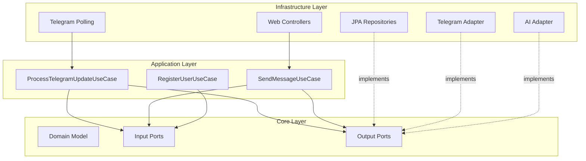
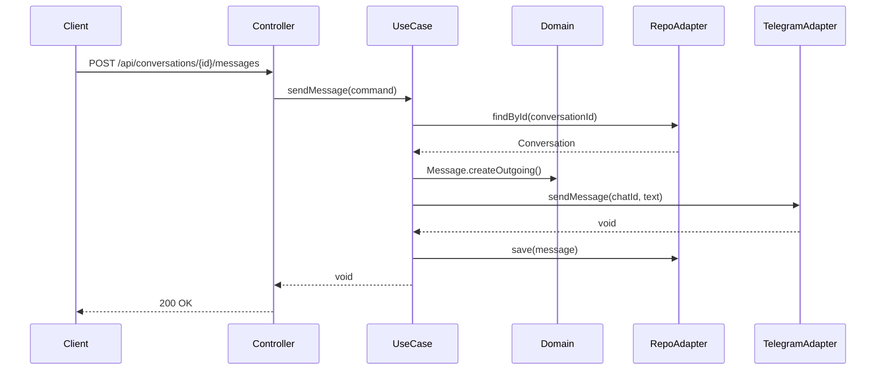

## What is Hexagonal Architecture?

Hexagonal Architecture, coined by Alistair Cockburn, is a design pattern that places the business logic at the center (the "hexagon") and isolates it from external concerns through well-defined ports and adapters.

<Info>
  Also known as **Ports and Adapters** architecture, this pattern ensures that the core business logic is independent of frameworks, databases, UIs, and external APIs.
</Info>

## Core Principles

### 1. Dependency Inversion

Dependencies always point **inward** toward the core domain. The core never depends on infrastructure:

```
Infrastructure → Application → Core
     ❌      ←        ❌      ←  ✅
```

<Note>
  The core layer defines **interfaces** (ports), and the infrastructure layer provides **implementations** (adapters).
</Note>

### 2. Separation of Concerns

<CardGroup cols={3}>
  <Card title="Core Domain" icon="gem">
    Business rules, entities, value objects - pure Java
  </Card>
  <Card title="Application Logic" icon="gears">
    Use cases that orchestrate domain operations
  </Card>
  <Card title="Infrastructure" icon="server">
    Technical details: REST, JPA, external APIs
  </Card>
</CardGroup>

### 3. Ports Define Contracts

**Ports** are interfaces that define communication contracts:

- **Input Ports (Primary)**: How the outside world uses the application
- **Output Ports (Secondary)**: What the application needs from external systems

## Implementation in TelegrmBot

### The Hexagon Layers



### Core Layer: Zero External Dependencies

The core layer in `src/main/java/com/acamus/telegrm/core/` contains:

<Accordion title="Domain Model (core/domain/model/)">
```java
// User.java - Pure domain entity
public class User {
    private String id;
    private Email email;
    private Password password;
    private String name;
    private boolean enabled;
    private LocalDateTime createdAt;
    
    public static User create(String name, Email email, Password password) {
        User user = new User();
        user.id = UUID.randomUUID().toString();
        user.name = name;
        user.email = Objects.requireNonNull(email);
        user.password = Objects.requireNonNull(password);
        user.enabled = true;
        user.createdAt = LocalDateTime.now();
        return user;
    }
    
    // Factory method for reconstruction from persistence
    public static User reconstruct(String id, String name, Email email, 
                                   Password password, boolean enabled, 
                                   LocalDateTime createdAt, 
                                   LocalDateTime lastLoginAt) {
        // ...
    }
}
```

Notice: No `@Entity`, no `@Table`, no Spring annotations. Pure Java.
</Accordion>

<Accordion title="Value Objects (core/domain/valueobjects/)">
```java
// Email.java - Guarantees validity
public record Email(String value) {
    private static final Pattern EMAIL_PATTERN =
        Pattern.compile("^[A-Za-z0-9+_.-]+@([A-Za-z0-9.-]+\\.[A-Za-z]{2,})$");
    
    public Email {
        Objects.requireNonNull(value, "Email cannot be null");
        if (value.isBlank()) {
            throw new IllegalArgumentException("Email cannot be blank");
        }
        if (!EMAIL_PATTERN.matcher(value).matches()) {
            throw new IllegalArgumentException("Invalid email format: " + value);
        }
        value = value.trim();
    }
}
```

Value objects enforce business rules at construction time.
</Accordion>

<Accordion title="Input Ports (core/ports/in/)">
```java
// ProcessTelegramUpdatePort.java
public interface ProcessTelegramUpdatePort {
    void processUpdate(ProcessUpdateCommand command);
}
```

Input ports define **what the application can do**. They are implemented by use cases.
</Accordion>

<Accordion title="Output Ports (core/ports/out/)">
```java
// ConversationRepositoryPort.java
public interface ConversationRepositoryPort {
    Conversation save(Conversation conversation);
    Optional<Conversation> findByTelegramChatId(Long telegramChatId);
    Optional<Conversation> findById(String id);
    List<Conversation> findAll();
}

// AiGeneratorPort.java
public interface AiGeneratorPort {
    String generateResponse(String userInput);
}

// TelegramPort.java
public interface TelegramPort {
    List<Update> getUpdates(long offset);
    void sendMessage(long chatId, String text);
}
```

Output ports define **what the application needs**. They are implemented by infrastructure adapters.
</Accordion>

## Request Flow: Telegram Message Processing

Let's trace how a Telegram message flows through the hexagonal architecture:

### 1. Input Adapter Receives External Event

```java
// TelegramPollingService.java (Infrastructure Layer)
@Component
public class TelegramPollingService {
    private final TelegramPort telegramPort;
    private final ProcessTelegramUpdatePort processTelegramUpdatePort;
    
    @Scheduled(fixedRate = 5000)
    public void pollForUpdates() {
        List<Update> updates = telegramPort.getUpdates(lastUpdateId + 1);
        
        for (Update update : updates) {
            MessageDto messageDto = update.message();
            UserDto userDto = messageDto.from();
            
            // Convert DTO to Command (core object)
            ProcessUpdateCommand command = new ProcessUpdateCommand(
                messageDto.chat().id(),
                messageDto.text(),
                userDto.firstName(),
                userDto.lastName(),
                userDto.username()
            );
            
            // Invoke the input port
            processTelegramUpdatePort.processUpdate(command);
        }
    }
}
```

<Tip>
  The scheduler is an **input adapter** that drives the application. It converts external data (Telegram DTOs) into domain commands.
</Tip>

### 2. Use Case Orchestrates Business Logic

```java
// ProcessTelegramUpdateUseCase.java (Application Layer)
public class ProcessTelegramUpdateUseCase implements ProcessTelegramUpdatePort {
    
    private final ConversationRepositoryPort conversationRepository;
    private final MessageRepositoryPort messageRepository;
    private final TelegramPort telegramPort;
    private final AiGeneratorPort aiGeneratorPort;
    
    @Override
    public void processUpdate(ProcessUpdateCommand command) {
        // 1. Find or create conversation
        Conversation conversation = conversationRepository
            .findByTelegramChatId(command.chatId())
            .orElseGet(() -> {
                Conversation newConv = Conversation.create(
                    new TelegramChatId(command.chatId()),
                    command.firstName(),
                    command.lastName(),
                    command.username()
                );
                return conversationRepository.save(newConv);
            });
        
        // 2. Save incoming message
        Message incomingMessage = Message.createIncoming(
            conversation.getId(), 
            new MessageContent(command.text())
        );
        messageRepository.save(incomingMessage);
        
        // 3. Generate AI response
        String responseText = aiGeneratorPort.generateResponse(command.text());
        
        // 4. Send to Telegram
        telegramPort.sendMessage(command.chatId(), responseText);
        
        // 5. Save outgoing message
        Message outgoingMessage = Message.createOutgoing(
            conversation.getId(), 
            new MessageContent(responseText)
        );
        messageRepository.save(outgoingMessage);
        
        // 6. Update conversation timestamp
        conversation.updateLastMessageAt();
        conversationRepository.save(conversation);
    }
}
```

<Note>
  The use case knows nothing about:
  - Spring Framework
  - PostgreSQL or JPA
  - Telegram Bot API
  - OpenRouter API
  
  It only knows about **domain models** and **port interfaces**.
</Note>

### 3. Output Adapters Execute Technical Operations

#### Persistence Adapter

```java
// ConversationRepositoryAdapter.java (Infrastructure Layer)
@Component
@RequiredArgsConstructor
public class ConversationRepositoryAdapter implements ConversationRepositoryPort {
    
    private final ConversationJpaRepository jpaRepository;
    
    @Override
    public Conversation save(Conversation conversation) {
        ConversationEntity entity = ConversationEntity.fromDomain(conversation);
        return jpaRepository.save(entity).toDomain();
    }
    
    @Override
    public Optional<Conversation> findByTelegramChatId(Long telegramChatId) {
        return jpaRepository.findByTelegramChatId(telegramChatId)
                .map(ConversationEntity::toDomain);
    }
}
```

The adapter converts between domain models and JPA entities.

#### AI Adapter

```java
// OpenRouterAdapter.java (Infrastructure Layer)
@Component
public class OpenRouterAdapter implements AiGeneratorPort {
    
    private final RestClient restClient;
    private final String model;
    
    @Override
    public String generateResponse(String userInput) {
        ChatMessage systemMessage = new ChatMessage("system", systemPrompt, null);
        ChatMessage userMessage = new ChatMessage("user", userInput, null);
        
        OpenRouterRequest request = new OpenRouterRequest(
            model, 
            List.of(systemMessage, userMessage), 
            maxTokens, 
            temperature
        );
        
        OpenRouterResponse response = restClient.post()
            .uri("/chat/completions")
            .body(request)
            .retrieve()
            .body(OpenRouterResponse.class);
        
        return response.choices().getFirst().message().content();
    }
}
```

The adapter handles HTTP communication and error handling.

#### Telegram Adapter

```java
// TelegramAdapter.java (Infrastructure Layer)
@Component
public class TelegramAdapter implements TelegramPort {
    
    private final RestClient telegramRestClient;
    
    @Override
    public void sendMessage(long chatId, String text) {
        telegramRestClient.get()
            .uri("/sendMessage?chat_id={chatId}&text={text}", chatId, text)
            .retrieve()
            .toBodilessEntity();
    }
}
```

## REST API Flow Example

Another flow: proactive message sending via REST API:



```java
// ConversationController.java (Infrastructure - Input Adapter)
@RestController
@RequestMapping("/api/conversations")
public class ConversationController {
    
    private final SendMessagePort sendMessagePort;
    
    @PostMapping("/{id}/messages")
    public ResponseEntity<Void> sendMessage(
            @PathVariable String id, 
            @Valid @RequestBody SendMessageRequest request) {
        
        SendMessageCommand command = new SendMessageCommand(id, request.content());
        sendMessagePort.sendMessage(command);
        return ResponseEntity.ok().build();
    }
}
```

## Benefits of This Architecture

<CardGroup cols={2}>
  <Card title="Testability" icon="flask">
    Use cases can be tested with mocks, no Spring context needed
    ```java
    @Test
    void shouldProcessTelegramUpdate() {
        var mockRepo = mock(ConversationRepositoryPort.class);
        var mockAI = mock(AiGeneratorPort.class);
        var useCase = new ProcessTelegramUpdateUseCase(...);
        
        useCase.processUpdate(command);
        
        verify(mockRepo).save(any());
    }
    ```
  </Card>
  
  <Card title="Technology Independence" icon="shield">
    Core business logic survives technology changes
    - Swap PostgreSQL for MongoDB
    - Replace OpenRouter with OpenAI
    - Change from REST to GraphQL
  </Card>
  
  <Card title="Clear Boundaries" icon="border-all">
    Each layer has a clear responsibility:
    - Core: Business rules
    - Application: Workflows
    - Infrastructure: Technical implementation
  </Card>
  
  <Card title="Parallel Development" icon="users">
    Teams can work independently:
    - Backend team on use cases
    - Infrastructure team on adapters
    - Frontend team on API contracts
  </Card>
</CardGroup>

## Dependency Injection

Spring assembles the hexagon through dependency injection:

```java
// UseCaseConfig.java (Infrastructure Layer)
@Configuration
public class UseCaseConfig {
    
    @Bean
    public ProcessTelegramUpdatePort processTelegramUpdateUseCase(
            ConversationRepositoryPort conversationRepository,
            MessageRepositoryPort messageRepository,
            TelegramPort telegramPort,
            AiGeneratorPort aiGeneratorPort) {
        
        return new ProcessTelegramUpdateUseCase(
            conversationRepository,
            messageRepository,
            telegramPort,
            aiGeneratorPort
        );
    }
}
```

<Info>
  The infrastructure layer **knows about everything**. It creates concrete instances and wires them together. The core and application layers know only abstractions.
</Info>

## Key Takeaways

1. **Core is Pure**: No framework dependencies in domain models
2. **Ports Define Contracts**: Interfaces separate concerns
3. **Adapters Implement Details**: Technical implementations stay in infrastructure
4. **Dependencies Point Inward**: Core never depends on infrastructure
5. **Easy to Test**: Mock the ports, test the logic

<Tip>
  When adding new features, start with the domain model and ports in the core. Only then implement the use case and adapters.
</Tip>
