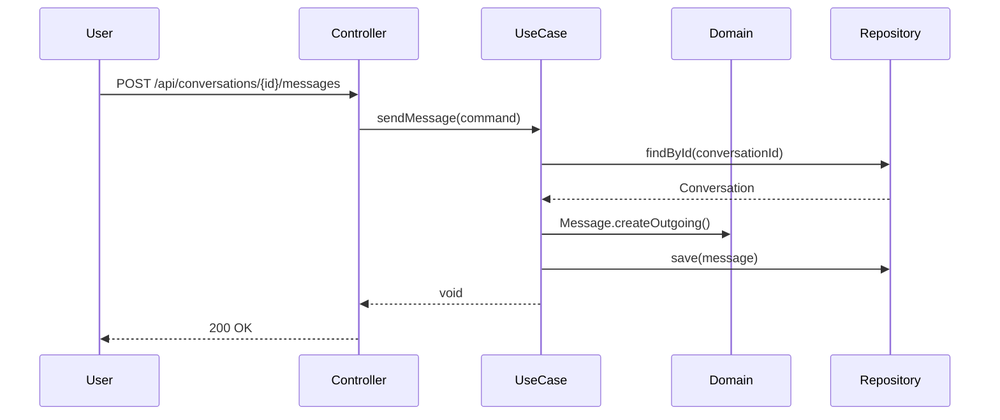

## Introduction

The TelegrmBot API is built using **Hexagonal Architecture** (also known as Ports and Adapters), a design pattern that promotes separation of concerns, testability, and maintainability. This architecture ensures the business logic remains independent of external frameworks, databases, and APIs.

## Three-Layer Structure

The application is organized into three distinct layers:

```
src/main/java/com/acamus/telegrm/
├── core/               # The Hexagon (Domain)
├── application/        # Use Cases
└── infrastructure/     # Adapters & Framework Code
```

<CardGroup cols={3}>
  <Card title="Core" icon="gem">
    Pure business logic with no external dependencies
  </Card>
  <Card title="Application" icon="gears">
    Use case orchestration and business workflows
  </Card>
  <Card title="Infrastructure" icon="plug">
    External integrations and framework-specific code
  </Card>
</CardGroup>

## Core Layer (The Hexagon)

The core layer is the heart of the application and contains:

<Accordion title="Domain Model">
  Entities that encapsulate business rules and state:
  - **User**: Represents authenticated users of the system
  - **Conversation**: Telegram chat sessions with metadata
  - **Message**: Individual messages with direction (incoming/outgoing)
</Accordion>

<Accordion title="Value Objects">
  Immutable objects that ensure data validity:
  - **Email**: Validates email format
  - **Password**: Ensures non-empty passwords
  - **TelegramChatId**: Wraps Telegram chat identifiers
  - **MessageContent**: Validates message length (Telegram's 4096 char limit)
</Accordion>

<Accordion title="Ports (Interfaces)">
  - **Input Ports**: Define how external actors interact with the application
  - **Output Ports**: Define what the application needs from the outside world
</Accordion>

<Note>
  The core layer has **zero dependencies** on Spring, JPA, or any external libraries (except Jakarta validation annotations).
</Note>

## Application Layer

This layer contains **Use Cases** that implement the input ports. Each use case has a single responsibility:

- `RegisterUserUseCase` - User registration
- `AuthenticateUserUseCase` - User authentication
- `ProcessTelegramUpdateUseCase` - Handle incoming Telegram messages
- `SendMessageUseCase` - Send proactive messages to Telegram
- `ListConversationsUseCase` - Retrieve all conversations
- `GetMessagesByConversationUseCase` - Retrieve conversation history

<Info>
  Use cases orchestrate business logic by coordinating domain models and output ports, but contain no framework-specific code.
</Info>

## Infrastructure Layer

The infrastructure layer connects the application to the outside world:

### Input Adapters (Driving)

<Card title="Web Controllers" icon="globe">
  REST endpoints that receive HTTP requests and invoke use cases
  - `AuthController` - `/api/auth/*`
  - `ConversationController` - `/api/conversations/*`
</Card>

<Card title="Schedulers" icon="clock">
  Background tasks that trigger use cases
  - `TelegramPollingService` - Polls Telegram API every 5 seconds
</Card>

### Output Adapters (Driven)

These implement the output ports defined in the core:

- **Persistence Adapters**: JPA repositories for PostgreSQL
- **Telegram Adapter**: REST client for Telegram Bot API
- **AI Adapter**: REST client for OpenRouter API
- **Security Adapters**: JWT token generation and password hashing

## Key Benefits

<CardGroup cols={2}>
  <Card title="Testability" icon="flask">
    Business logic can be tested without frameworks or databases
  </Card>
  <Card title="Independence" icon="shield">
    Core domain is isolated from technology choices
  </Card>
  <Card title="Flexibility" icon="wand-magic-sparkles">
    Easy to swap implementations (e.g., change from PostgreSQL to MongoDB)
  </Card>
  <Card title="Maintainability" icon="wrench">
    Clear separation of concerns makes code easier to understand
  </Card>
</CardGroup>

## Request Flow Example



<Tip>
  The controller knows about the use case, but the use case doesn't know about the controller. Dependencies always point inward toward the core.
</Tip>

## Directory Structure

```
com.acamus.telegrm
│
├── core
│   ├── domain
│   │   ├── model/          # Entities (User, Conversation, Message)
│   │   ├── valueobjects/   # Value objects (Email, Password, etc.)
│   │   └── exception/      # Business exceptions
│   └── ports
│       ├── in/             # Input ports (interfaces)
│       │   ├── user/
│       │   ├── conversation/
│       │   └── telegram/
│       └── out/            # Output ports (interfaces)
│           ├── user/
│           ├── conversation/
│           ├── ai/
│           ├── telegram/
│           └── security/
│
├── application
│   └── usecases/           # Use case implementations
│       ├── user/
│       ├── conversation/
│       └── telegram/
│
└── infrastructure
    ├── adapters
    │   ├── in/             # Driving adapters
    │   │   ├── web/        # REST controllers
    │   │   └── scheduler/  # Scheduled tasks
    │   └── out/            # Driven adapters
    │       ├── persistence/
    │       ├── telegram/
    │       ├── ai/
    │       └── security/
    ├── config/             # Spring configuration
    ├── decorators/         # Transactional decorators
    └── exceptions/         # Global exception handling
```

## Next Steps

<CardGroup cols={2}>
  <Card title="Hexagonal Architecture Deep Dive" icon="hexagon" href="/architecture/hexagonal-architecture">
    Learn about the hexagonal architecture pattern and implementation
  </Card>
  <Card title="Domain Model" icon="cube" href="/architecture/domain-model">
    Explore the domain entities and value objects
  </Card>
  <Card title="Ports and Adapters" icon="plug" href="/architecture/ports-and-adapters">
    Understand the port interfaces and adapter implementations
  </Card>
</CardGroup>
