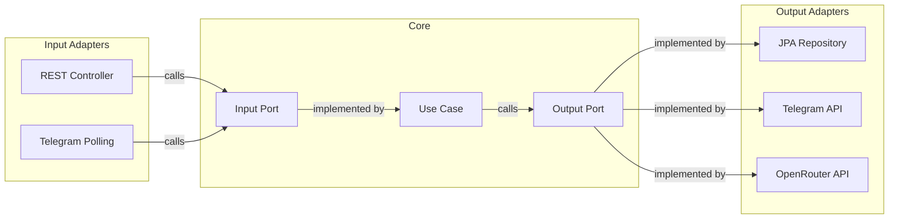
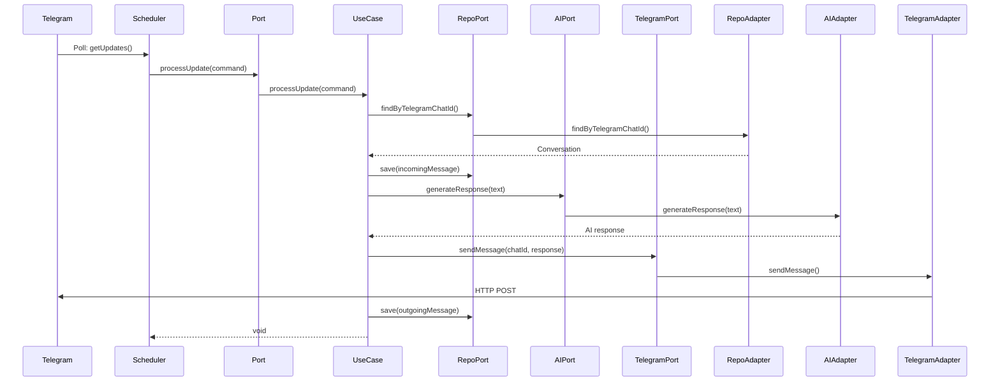

## Introduction

In hexagonal architecture, **ports** are interfaces that define contracts, while **adapters** are concrete implementations that connect the application to external systems. This separation allows the core business logic to remain independent of technology choices.

<Info>
  Ports are defined in the **core layer**, while adapters are implemented in the **infrastructure layer**.
</Info>

## Port Types

<CardGroup cols={2}>
  <Card title="Input Ports (Primary)" icon="arrow-right-to-bracket">
    Define **what the application can do**
    
    - Also called "driving ports" or "use case interfaces"
    - Implemented by use cases in the application layer
    - Invoked by input adapters (controllers, schedulers)
  </Card>
  
  <Card title="Output Ports (Secondary)" icon="arrow-right-from-bracket">
    Define **what the application needs**
    
    - Also called "driven ports" or "SPI (Service Provider Interface)"
    - Implemented by output adapters (repositories, API clients)
    - Called by use cases to access external resources
  </Card>
</CardGroup>



## Input Ports

Input ports define the application's **use cases** - the operations that external actors can trigger.

### User Management Ports

<Accordion title="RegisterUserPort - User Registration">
```java
// src/main/java/com/acamus/telegrm/core/ports/in/user/RegisterUserPort.java
package com.acamus.telegrm.core.ports.in.user;

public interface RegisterUserPort {
    String register(RegisterUserCommand command);
}

// Command object
public record RegisterUserCommand(
    String name,
    String email,
    String password
) {}
```

**Implemented by:** `RegisterUserUseCase`

**Invoked by:** `AuthController` (REST endpoint)

**Purpose:** Create new user accounts with validation
</Accordion>

<Accordion title="AuthenticateUserPort - User Authentication">
```java
// src/main/java/com/acamus/telegrm/core/ports/in/user/AuthenticateUserPort.java
package com.acamus.telegrm.core.ports.in.user;

public interface AuthenticateUserPort {
    String authenticate(AuthenticateUserCommand command);
}

public record AuthenticateUserCommand(
    String email,
    String password
) {}
```

**Implemented by:** `AuthenticateUserUseCase`

**Invoked by:** `AuthController` (REST endpoint)

**Purpose:** Validate credentials and return JWT token
</Accordion>

### Telegram Integration Ports

<Accordion title="ProcessTelegramUpdatePort - Handle Incoming Messages">
```java
// src/main/java/com/acamus/telegrm/core/ports/in/telegram/ProcessTelegramUpdatePort.java
package com.acamus.telegrm.core.ports.in.telegram;

public interface ProcessTelegramUpdatePort {
    void processUpdate(ProcessUpdateCommand command);
}

public record ProcessUpdateCommand(
    long chatId,
    String text,
    String firstName,
    String lastName,
    String username
) {}
```

**Implemented by:** `ProcessTelegramUpdateUseCase`

**Invoked by:** `TelegramPollingService` (Scheduler)

**Purpose:** Process incoming Telegram messages and generate AI responses

**Flow:**
1. Receive message from Telegram user
2. Find or create conversation
3. Save incoming message
4. Generate AI response
5. Send response to Telegram
6. Save outgoing message
</Accordion>

### Conversation Management Ports

<Accordion title="SendMessagePort - Send Proactive Messages">
```java
// src/main/java/com/acamus/telegrm/core/ports/in/conversation/SendMessagePort.java
package com.acamus.telegrm.core.ports.in.conversation;

public interface SendMessagePort {
    void sendMessage(SendMessageCommand command);
}

public record SendMessageCommand(
    String conversationId,
    String content
) {}
```

**Implemented by:** `SendMessageUseCase`

**Invoked by:** `ConversationController` (REST endpoint)

**Purpose:** Allow administrators to send messages proactively
</Accordion>

<Accordion title="ListConversationsPort - Retrieve All Conversations">
```java
// src/main/java/com/acamus/telegrm/core/ports/in/conversation/ListConversationsPort.java
package com.acamus.telegrm.core.ports.in.conversation;

import com.acamus.telegrm.core.domain.model.Conversation;
import java.util.List;

public interface ListConversationsPort {
    List<Conversation> listAll();
}
```

**Implemented by:** `ListConversationsUseCase`

**Invoked by:** `ConversationController` (REST endpoint)

**Purpose:** Retrieve all conversations for admin dashboard
</Accordion>

<Accordion title="GetMessagesByConversationPort - Retrieve Conversation History">
```java
// src/main/java/com/acamus/telegrm/core/ports/in/conversation/GetMessagesByConversationPort.java
package com.acamus.telegrm.core.ports.in.conversation;

import com.acamus.telegrm.core.domain.model.Message;
import java.util.List;

public interface GetMessagesByConversationPort {
    List<Message> getMessages(String conversationId);
}
```

**Implemented by:** `GetMessagesByConversationUseCase`

**Invoked by:** `ConversationController` (REST endpoint)

**Purpose:** Display message history for a conversation
</Accordion>

## Output Ports

Output ports define the **external dependencies** the application needs - persistence, APIs, security services, etc.

### Repository Ports (Persistence)

<Accordion title="UserRepositoryPort - User Data Access">
```java
// src/main/java/com/acamus/telegrm/core/ports/out/user/UserRepositoryPort.java
package com.acamus.telegrm.core.ports.out.user;

import com.acamus.telegrm.core.domain.model.User;
import java.util.Optional;

public interface UserRepositoryPort {
    User save(User user);
    Optional<User> findByEmail(String email);
}
```

**Implemented by:** `UserRepositoryAdapter` (JPA implementation)

**Used by:** `RegisterUserUseCase`, `AuthenticateUserUseCase`
</Accordion>

<Accordion title="ConversationRepositoryPort - Conversation Data Access">
```java
// src/main/java/com/acamus/telegrm/core/ports/out/conversation/ConversationRepositoryPort.java
package com.acamus.telegrm.core.ports.out.conversation;

import com.acamus.telegrm.core.domain.model.Conversation;
import java.util.List;
import java.util.Optional;

public interface ConversationRepositoryPort {
    Conversation save(Conversation conversation);
    Optional<Conversation> findByTelegramChatId(Long telegramChatId);
    Optional<Conversation> findById(String id);
    List<Conversation> findAll();
}
```

**Implemented by:** `ConversationRepositoryAdapter` (JPA implementation)

**Used by:** Multiple use cases for conversation management

**Implementation Example:**
```java
// src/main/java/com/acamus/telegrm/infrastructure/adapters/out/persistence/ConversationRepositoryAdapter.java
@Component
@RequiredArgsConstructor
public class ConversationRepositoryAdapter implements ConversationRepositoryPort {
    
    private final ConversationJpaRepository jpaRepository;
    
    @Override
    public Conversation save(Conversation conversation) {
        ConversationEntity entity = ConversationEntity.fromDomain(conversation);
        return jpaRepository.save(entity).toDomain();
    }
    
    @Override
    public Optional<Conversation> findByTelegramChatId(Long telegramChatId) {
        return jpaRepository.findByTelegramChatId(telegramChatId)
                .map(ConversationEntity::toDomain);
    }
    
    @Override
    public Optional<Conversation> findById(String id) {
        return jpaRepository.findById(id)
                .map(ConversationEntity::toDomain);
    }
    
    @Override
    public List<Conversation> findAll() {
        return jpaRepository.findAll().stream()
                .map(ConversationEntity::toDomain)
                .toList();
    }
}
```

<Note>
  The adapter translates between domain models (`Conversation`) and JPA entities (`ConversationEntity`). This keeps JPA concerns out of the domain.
</Note>
</Accordion>

<Accordion title="MessageRepositoryPort - Message Data Access">
```java
// src/main/java/com/acamus/telegrm/core/ports/out/conversation/MessageRepositoryPort.java
package com.acamus.telegrm.core.ports.out.conversation;

import com.acamus.telegrm.core.domain.model.Message;
import java.util.List;

public interface MessageRepositoryPort {
    Message save(Message message);
    List<Message> findByConversationId(String conversationId);
}
```

**Implemented by:** `MessageRepositoryAdapter` (JPA implementation)

**Used by:** Use cases that manage message history
</Accordion>

### External API Ports

<Accordion title="TelegramPort - Telegram Bot API Integration">
```java
// src/main/java/com/acamus/telegrm/core/ports/out/telegram/TelegramPort.java
package com.acamus.telegrm.core.ports.out.telegram;

import com.acamus.telegrm.infrastructure.adapters.out.telegram.dto.Update;
import java.util.List;

public interface TelegramPort {
    List<Update> getUpdates(long offset);
    void sendMessage(long chatId, String text);
}
```

**Implemented by:** `TelegramAdapter` (REST client implementation)

**Used by:** `TelegramPollingService`, `ProcessTelegramUpdateUseCase`, `SendMessageUseCase`

**Implementation:**
```java
// src/main/java/com/acamus/telegrm/infrastructure/adapters/out/telegram/TelegramAdapter.java
@Component
public class TelegramAdapter implements TelegramPort {
    
    private final RestClient telegramRestClient;
    
    public TelegramAdapter(@Qualifier("telegramRestClient") RestClient client) {
        this.telegramRestClient = client;
    }
    
    @Override
    public List<Update> getUpdates(long offset) {
        GetUpdatesResponse response = telegramRestClient.get()
                .uri("/getUpdates?offset={offset}", offset)
                .retrieve()
                .body(GetUpdatesResponse.class);
        
        return (response != null && response.ok()) 
            ? response.result() 
            : Collections.emptyList();
    }
    
    @Override
    public void sendMessage(long chatId, String text) {
        telegramRestClient.get()
                .uri("/sendMessage?chat_id={chatId}&text={text}", chatId, text)
                .retrieve()
                .toBodilessEntity();
    }
}
```

<Tip>
  The adapter uses Spring's `RestClient` but the core only knows about the `TelegramPort` interface. We could swap to WebClient, Feign, or raw HTTP without changing the core.
</Tip>
</Accordion>

<Accordion title="AiGeneratorPort - AI Response Generation">
```java
// src/main/java/com/acamus/telegrm/core/ports/out/ai/AiGeneratorPort.java
package com.acamus.telegrm.core.ports.out.ai;

public interface AiGeneratorPort {
    String generateResponse(String userInput);
}
```

**Implemented by:** `OpenRouterAdapter` (OpenRouter API client)

**Used by:** `ProcessTelegramUpdateUseCase`

**Implementation:**
```java
// src/main/java/com/acamus/telegrm/infrastructure/adapters/out/ai/OpenRouterAdapter.java
@Component
public class OpenRouterAdapter implements AiGeneratorPort {
    
    private final RestClient restClient;
    private final String model;
    private final String systemPrompt;
    private final double temperature;
    private final int maxTokens;
    
    @Override
    public String generateResponse(String userInput) {
        try {
            ChatMessage systemMessage = new ChatMessage("system", systemPrompt, null);
            ChatMessage userMessage = new ChatMessage("user", userInput, null);
            
            OpenRouterRequest request = new OpenRouterRequest(
                model, 
                List.of(systemMessage, userMessage), 
                maxTokens, 
                temperature
            );
            
            OpenRouterResponse response = restClient.post()
                    .uri("/chat/completions")
                    .body(request)
                    .retrieve()
                    .body(OpenRouterResponse.class);
            
            if (response != null && !response.choices().isEmpty()) {
                return response.choices().getFirst().message().content();
            }
        } catch (RestClientResponseException e) {
            return "La IA rechazó mi petición (HTTP " + e.getStatusCode() + ").";
        } catch (ResourceAccessException e) {
            return "No puedo conectar con la IA (Error de red).";
        } catch (Exception e) {
            return "Ocurrió un error interno: " + e.getMessage();
        }
        
        return "El silencio del vacío cósmico me responde.";
    }
}
```

<Info>
  The adapter handles all error scenarios and returns user-friendly messages. The use case doesn't need to know about HTTP status codes or network errors.
</Info>
</Accordion>

### Security Ports

<Accordion title="TokenGeneratorPort - JWT Token Creation">
```java
// src/main/java/com/acamus/telegrm/core/ports/out/security/TokenGeneratorPort.java
package com.acamus.telegrm.core.ports.out.security;

public interface TokenGeneratorPort {
    String generateToken(String subject);
}
```

**Implemented by:** `JwtTokenGenerator` (JWT library wrapper)

**Used by:** `AuthenticateUserUseCase`
</Accordion>

<Accordion title="PasswordHasherPort - Password Hashing">
```java
// src/main/java/com/acamus/telegrm/core/ports/out/security/PasswordHasherPort.java
package com.acamus.telegrm.core.ports.out.security;

public interface PasswordHasherPort {
    String hash(String plainPassword);
    boolean matches(String plainPassword, String hashedPassword);
}
```

**Implemented by:** `BcryptPasswordHasher` (BCrypt wrapper)

**Used by:** `RegisterUserUseCase`, `AuthenticateUserUseCase`
</Accordion>

## Input Adapters

Input adapters **drive** the application by invoking input ports.

### REST Controllers

<Accordion title="AuthController - Authentication Endpoints">
```java
// src/main/java/com/acamus/telegrm/infrastructure/adapters/in/web/auth/AuthController.java
@RestController
@RequestMapping("/api/auth")
@RequiredArgsConstructor
public class AuthController {
    
    private final RegisterUserPort registerUserPort;
    private final AuthenticateUserPort authenticateUserPort;
    
    @PostMapping("/register")
    public ResponseEntity<AuthResponse> register(
            @Valid @RequestBody RegisterRequest request) {
        
        RegisterUserCommand command = new RegisterUserCommand(
            request.name(),
            request.email(),
            request.password()
        );
        
        String token = registerUserPort.register(command);
        return ResponseEntity.ok(new AuthResponse(token));
    }
    
    @PostMapping("/login")
    public ResponseEntity<AuthResponse> login(
            @Valid @RequestBody LoginRequest request) {
        
        AuthenticateUserCommand command = new AuthenticateUserCommand(
            request.email(),
            request.password()
        );
        
        String token = authenticateUserPort.authenticate(command);
        return ResponseEntity.ok(new AuthResponse(token));
    }
}
```

<Note>
  The controller converts DTOs (`RegisterRequest`) to commands (`RegisterUserCommand`) and invokes the port. It knows about HTTP and JSON, but the use case doesn't.
</Note>
</Accordion>

<Accordion title="ConversationController - Conversation Management">
```java
// src/main/java/com/acamus/telegrm/infrastructure/adapters/in/web/conversation/ConversationController.java
@RestController
@RequestMapping("/api/conversations")
@RequiredArgsConstructor
@PreAuthorize("isAuthenticated()")
public class ConversationController {
    
    private final ListConversationsPort listConversationsPort;
    private final GetMessagesByConversationPort getMessagesByConversationPort;
    private final SendMessagePort sendMessagePort;
    
    @GetMapping
    public ResponseEntity<List<ConversationSummaryDto>> listConversations() {
        List<Conversation> conversations = listConversationsPort.listAll();
        List<ConversationSummaryDto> dtos = conversations.stream()
                .map(this::toSummaryDto)
                .toList();
        return ResponseEntity.ok(dtos);
    }
    
    @GetMapping("/{id}/messages")
    public ResponseEntity<List<MessageDto>> getMessages(@PathVariable String id) {
        List<Message> messages = getMessagesByConversationPort.getMessages(id);
        List<MessageDto> dtos = messages.stream()
                .map(this::toMessageDto)
                .toList();
        return ResponseEntity.ok(dtos);
    }
    
    @PostMapping("/{id}/messages")
    public ResponseEntity<Void> sendMessage(
            @PathVariable String id, 
            @Valid @RequestBody SendMessageRequest request) {
        
        SendMessageCommand command = new SendMessageCommand(id, request.content());
        sendMessagePort.sendMessage(command);
        return ResponseEntity.ok().build();
    }
}
```

<Tip>
  Controllers handle HTTP concerns (status codes, serialization) and security (`@PreAuthorize`), keeping these out of use cases.
</Tip>
</Accordion>

### Schedulers

<Accordion title="TelegramPollingService - Background Message Polling">
```java
// src/main/java/com/acamus/telegrm/infrastructure/adapters/in/scheduler/TelegramPollingService.java
@Component
@RequiredArgsConstructor
@Slf4j
public class TelegramPollingService {
    
    private final TelegramPort telegramPort;
    private final ProcessTelegramUpdatePort processTelegramUpdatePort;
    private long lastUpdateId = 0;
    
    @Scheduled(fixedRate = 5000)
    public void pollForUpdates() {
        log.info("Polling for new messages...");
        List<Update> updates = telegramPort.getUpdates(lastUpdateId + 1);
        
        if (!updates.isEmpty()) {
            log.info("Received {} new updates.", updates.size());
            for (Update update : updates) {
                if (update.message() != null && update.message().from() != null) {
                    MessageDto messageDto = update.message();
                    UserDto userDto = messageDto.from();
                    
                    ProcessUpdateCommand command = new ProcessUpdateCommand(
                        messageDto.chat().id(),
                        messageDto.text(),
                        userDto.firstName(),
                        userDto.lastName(),
                        userDto.username()
                    );
                    
                    processTelegramUpdatePort.processUpdate(command);
                }
                lastUpdateId = update.updateId();
            }
        }
    }
}
```

<Info>
  The scheduler runs every 5 seconds, polling Telegram's API for new messages. It converts Telegram DTOs to domain commands and invokes the input port.
</Info>
</Accordion>

## Complete Flow Example

Let's trace a complete request flow through all layers:

### Scenario: Incoming Telegram Message



### Code Walkthrough

**1. Scheduler (Input Adapter)** receives update from Telegram:
```java
ProcessUpdateCommand command = new ProcessUpdateCommand(
    chatId, text, firstName, lastName, username
);
processTelegramUpdatePort.processUpdate(command);
```

**2. Use Case** orchestrates the business logic:
```java
// src/main/java/com/acamus/telegrm/application/usecases/telegram/ProcessTelegramUpdateUseCase.java
public class ProcessTelegramUpdateUseCase implements ProcessTelegramUpdatePort {
    
    @Override
    public void processUpdate(ProcessUpdateCommand command) {
        // Find or create conversation (output port)
        Conversation conversation = conversationRepository
            .findByTelegramChatId(command.chatId())
            .orElseGet(() -> {
                Conversation newConv = Conversation.create(...);
                return conversationRepository.save(newConv);
            });
        
        // Save incoming message
        Message incomingMessage = Message.createIncoming(...);
        messageRepository.save(incomingMessage);
        
        // Generate AI response (output port)
        String responseText = aiGeneratorPort.generateResponse(command.text());
        
        // Send to Telegram (output port)
        telegramPort.sendMessage(command.chatId(), responseText);
        
        // Save outgoing message
        Message outgoingMessage = Message.createOutgoing(...);
        messageRepository.save(outgoingMessage);
        
        // Update conversation
        conversation.updateLastMessageAt();
        conversationRepository.save(conversation);
    }
}
```

**3. Output Adapters** handle technical details:
- `ConversationRepositoryAdapter` → PostgreSQL via JPA
- `OpenRouterAdapter` → OpenRouter API via REST
- `TelegramAdapter` → Telegram Bot API via REST

## Port Organization

```
core/ports/
├── in/                         # Input Ports (Use Case Interfaces)
│   ├── user/
│   │   ├── RegisterUserPort.java
│   │   ├── RegisterUserCommand.java
│   │   ├── AuthenticateUserPort.java
│   │   └── AuthenticateUserCommand.java
│   ├── conversation/
│   │   ├── ListConversationsPort.java
│   │   ├── GetMessagesByConversationPort.java
│   │   ├── SendMessagePort.java
│   │   └── SendMessageCommand.java
│   └── telegram/
│       ├── ProcessTelegramUpdatePort.java
│       └── ProcessUpdateCommand.java
│
└── out/                        # Output Ports (SPIs)
    ├── user/
    │   └── UserRepositoryPort.java
    ├── conversation/
    │   ├── ConversationRepositoryPort.java
    │   └── MessageRepositoryPort.java
    ├── telegram/
    │   └── TelegramPort.java
    ├── ai/
    │   └── AiGeneratorPort.java
    └── security/
        ├── TokenGeneratorPort.java
        └── PasswordHasherPort.java
```

## Adapter Organization

```
infrastructure/adapters/
├── in/                         # Input Adapters (Driving)
│   ├── web/
│   │   ├── auth/
│   │   │   └── AuthController.java
│   │   └── conversation/
│   │       └── ConversationController.java
│   └── scheduler/
│       └── TelegramPollingService.java
│
└── out/                        # Output Adapters (Driven)
    ├── persistence/
    │   ├── UserRepositoryAdapter.java
    │   ├── ConversationRepositoryAdapter.java
    │   └── MessageRepositoryAdapter.java
    ├── telegram/
    │   └── TelegramAdapter.java
    ├── ai/
    │   └── OpenRouterAdapter.java
    └── security/
        ├── JwtTokenGenerator.java
        └── BcryptPasswordHasher.java
```

## Key Benefits

<CardGroup cols={2}>
  <Card title="Testability" icon="flask">
    Mock the ports, test in isolation
    ```java
    @Test
    void test() {
        var mockRepo = mock(ConversationRepositoryPort.class);
        var useCase = new ProcessTelegramUpdateUseCase(mockRepo, ...);
        useCase.processUpdate(command);
        verify(mockRepo).save(any());
    }
    ```
  </Card>
  
  <Card title="Flexibility" icon="wand-magic-sparkles">
    Swap implementations without changing core
    - PostgreSQL → MongoDB
    - OpenRouter → OpenAI
    - REST → GraphQL
  </Card>
  
  <Card title="Clear Contracts" icon="file-contract">
    Interfaces document expectations
    ```java
    public interface AiGeneratorPort {
        // What does this do? Generate AI response
        // What do I need? User input string
        // What do I get? Response string
        String generateResponse(String userInput);
    }
    ```
  </Card>
  
  <Card title="Parallel Development" icon="users">
    Teams work on ports independently
    - Core team defines ports
    - Backend implements use cases
    - Infrastructure implements adapters
  </Card>
</CardGroup>

## Key Takeaways

1. **Ports Are Contracts**: Interfaces define communication protocols
2. **Input Ports = Use Cases**: What the application can do
3. **Output Ports = Dependencies**: What the application needs
4. **Adapters Are Implementations**: Technology-specific code
5. **Core Stays Pure**: No framework dependencies in ports
6. **Easy to Test**: Mock ports, test logic
7. **Easy to Replace**: Swap adapter implementations

<Tip>
  When adding new functionality, start by defining the port in the core layer. Then implement the use case, and finally create the adapters. This ensures the core drives the design, not the infrastructure.
</Tip>
