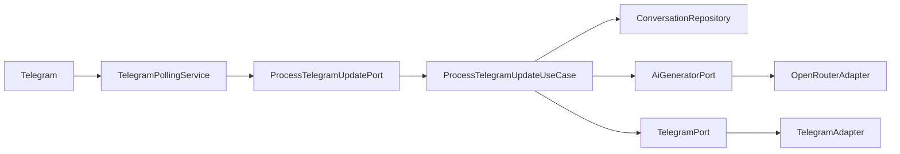

# TelegrmBot API

TelegrmBot API is a **Java-based REST API** that seamlessly integrates Telegram messaging with AI-powered conversational capabilities. Built on a strict **hexagonal architecture (ports and adapters)**, it provides a robust, maintainable foundation for managing Telegram bot interactions through a modern REST interface.

## What is TelegrmBot API?

This project combines three powerful capabilities:

1. **Telegram Integration** - Listens to Telegram messages via polling and sends responses programmatically
2. **AI-Powered Responses** - Generates intelligent replies using configurable language models through OpenRouter
3. **REST API Management** - Provides HTTP endpoints to list conversations, view message history, and send proactive messages

All of this is built on **Spring Boot 3** with **Java 21**, following domain-driven design principles and clean architecture patterns.

## Key Features

<CardGroup cols={2}>
  <Card title="JWT Authentication" icon="lock">
    Secure user registration and login system with JSON Web Tokens for API access control
  </Card>
  
  <Card title="Telegram Polling" icon="message">
    Automated message listening through Telegram's long polling mechanism with real-time processing
  </Card>
  
  <Card title="AI Integration" icon="brain">
    Configurable AI responses using OpenRouter's language models with customizable temperature and prompts
  </Card>
  
  <Card title="Hexagonal Architecture" icon="hexagon">
    Clean separation between domain logic and infrastructure using ports and adapters pattern
  </Card>
  
  <Card title="Database Versioning" icon="database">
    Automated schema migrations with Flyway for consistent deployments
  </Card>
  
  <Card title="Docker Support" icon="docker">
    Fully containerized with multi-stage builds and Docker Compose orchestration
  </Card>
  
  <Card title="OpenAPI Documentation" icon="book">
    Interactive Swagger UI for exploring and testing all API endpoints
  </Card>
  
  <Card title="Production Ready" icon="check">
    Includes health checks, security best practices, and comprehensive testing with Testcontainers
  </Card>
</CardGroup>

## Architecture Overview

The application follows a strict **hexagonal architecture** with three distinct layers:

<Steps>
  <Step title="Core Domain Layer">
    The innermost layer containing pure business logic with no framework dependencies:
    - **Entities**: `User`, `Conversation`, `Message`
    - **Value Objects**: `Email`, `Password`, `TelegramChatId`
    - **Ports**: Interfaces defining how the application interacts with the outside world
  </Step>
  
  <Step title="Application Layer">
    Use cases that orchestrate domain logic:
    - `RegisterUserUseCase` - Handle user registration
    - `ProcessTelegramUpdateUseCase` - Process incoming Telegram messages
    - `SendMessageUseCase` - Send proactive messages to Telegram chats
  </Step>
  
  <Step title="Infrastructure Layer">
    Adapters that connect to external systems:
    - **REST Controllers** - HTTP endpoints for API access
    - **JPA Repositories** - PostgreSQL persistence
    - **Telegram Client** - Telegram Bot API integration
    - **OpenRouter Client** - AI response generation
  </Step>
</Steps>

<Info>
This architectural approach ensures the core business logic remains independent of frameworks, databases, and external APIs - making the codebase highly testable and maintainable.
</Info>

## Use Cases

### Customer Support Bot
Automate initial customer support responses on Telegram while allowing human agents to take over through the REST API when needed.

### AI Assistant
Deploy a configurable AI assistant that responds to Telegram messages with customizable personality and behavior through system prompts.

### Notification System
Use the proactive messaging API to send alerts, reminders, or updates to Telegram users from your backend systems.

### Conversation Management
Build a dashboard to monitor and manage all Telegram conversations, view message history, and analyze user interactions.

## Technology Stack

<CodeGroup>
```xml pom.xml
<properties>
    <java.version>21</java.version>
</properties>

<dependencies>
    <!-- Spring Boot 3.5.10 -->
    <dependency>
        <groupId>org.springframework.boot</groupId>
        <artifactId>spring-boot-starter-web</artifactId>
    </dependency>
    <dependency>
        <groupId>org.springframework.boot</groupId>
        <artifactId>spring-boot-starter-security</artifactId>
    </dependency>
    <dependency>
        <groupId>org.springframework.boot</groupId>
        <artifactId>spring-boot-starter-data-jpa</artifactId>
    </dependency>
    
    <!-- PostgreSQL -->
    <dependency>
        <groupId>org.postgresql</groupId>
        <artifactId>postgresql</artifactId>
    </dependency>
    
    <!-- JWT -->
    <dependency>
        <groupId>io.jsonwebtoken</groupId>
        <artifactId>jjwt-api</artifactId>
        <version>0.12.5</version>
    </dependency>
</dependencies>
```
</CodeGroup>

| Component | Technology | Version |
|-----------|-----------|----------|
| Language | Java | 21 |
| Framework | Spring Boot | 3.5.10 |
| Database | PostgreSQL | 15 |
| Build Tool | Maven | 3.9+ |
| Security | JWT | 0.12.5 |
| Migrations | Flyway | Latest |
| API Docs | SpringDoc OpenAPI | 2.8.15 |
| Testing | JUnit 5, Testcontainers | Latest |

## Why Hexagonal Architecture?

The **hexagonal architecture** (also known as ports and adapters) provides several critical benefits:

<Tip>
**Domain Independence**: The core business logic has zero dependencies on Spring, JPA, or any external library. This means you can test business rules without starting a framework or database.
</Tip>

<Tip>
**Flexibility**: Swapping PostgreSQL for MongoDB or replacing OpenRouter with another AI provider requires only changing adapters - the core logic remains untouched.
</Tip>

<Tip>
**Testability**: Each layer can be tested in isolation. Domain logic uses pure unit tests, while adapters can be tested with integration tests.
</Tip>

<Tip>
**Long-term Maintainability**: Business rules are clearly separated from technical implementation details, making the codebase easier to understand and evolve.
</Tip>

## Request Flow Example

Here's how a Telegram message flows through the architecture:



1. **TelegramPollingService** (scheduler) polls Telegram API for new messages
2. Converts the Telegram update to a **ProcessUpdateCommand**
3. Invokes the **ProcessTelegramUpdatePort** (use case interface)
4. **ProcessTelegramUpdateUseCase** executes domain logic:
   - Finds or creates conversation using repository port
   - Saves incoming message
   - Requests AI response through AI port
   - Sends response through Telegram port
5. Infrastructure adapters handle actual API calls and database operations

<Warning>
The use case never knows it's talking to PostgreSQL or OpenRouter - it only knows the abstract port interfaces. This is the core principle of dependency inversion.
</Warning>

## What's Next?

<CardGroup cols={2}>
  <Card title="Quick Start" icon="rocket" href="/quickstart">
    Get the bot running in under 5 minutes with Docker
  </Card>
  
  <Card title="Installation Guide" icon="download" href="/installation">
    Detailed setup for both Docker and local development
  </Card>
</CardGroup>