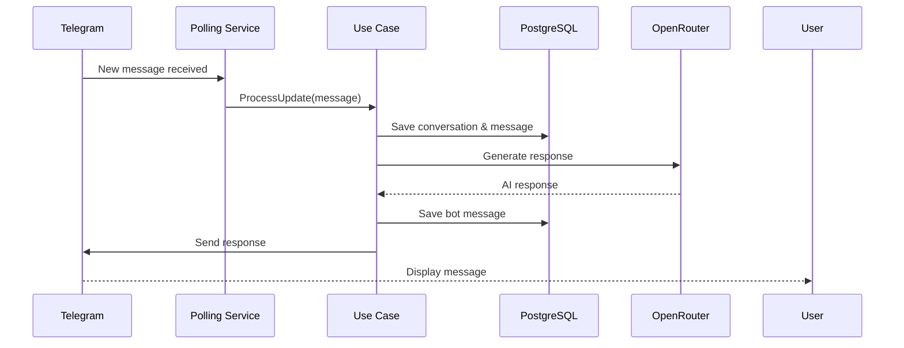

# Quick Start Guide

This guide will get you from zero to a running Telegram bot with AI responses in under 5 minutes using Docker.

## Prerequisites

Before starting, ensure you have:

- **Docker** and **Docker Compose** installed
- A **Telegram account** to create a bot
- An **OpenRouter account** for AI responses (free tier available)

<Info>
If you don't have Docker installed, see the [Installation Guide](/installation) for detailed setup instructions.
</Info>

## Step 1: Clone the Repository

```bash
git clone https://github.com/acamus79/TlgrmBot.git
cd TlgrmBot
```

## Step 2: Get Your API Keys

<Steps>
  <Step title="Create a Telegram Bot">
    Open Telegram and start a chat with **@BotFather**:
    
    ```
    /newbot
    ```
    
    Follow the prompts to:
    1. Choose a name for your bot (e.g., "My AI Assistant")
    2. Choose a username (must end in `bot`, e.g., `my_ai_assistant_bot`)
    3. Copy the **bot token** that BotFather provides
    
    <Tip>
    Save this token securely - you'll need it in the next step. It looks like:
    `1234567890:ABCdefGHIjklMNOpqrsTUVwxyz`
    </Tip>
  </Step>
  
  <Step title="Get OpenRouter API Key">
    1. Visit [OpenRouter.ai](https://openrouter.ai)
    2. Sign up for a free account
    3. Navigate to **Keys** section
    4. Click **Create Key** and copy the generated key
    
    <Note>
    OpenRouter provides free access to several AI models. The default configuration uses `tngtech/deepseek-r1t2-chimera:free`.
    </Note>
  </Step>
  
  <Step title="Generate JWT Secret">
    Generate a secure random string for signing JWT tokens:
    
    ```bash
    openssl rand -base64 32
    ```
    
    Copy the output - you'll use this as your JWT secret.
  </Step>
</Steps>

## Step 3: Configure Environment Variables

Create a `.env` file in the project root:

```bash
cp .env.example .env
```

Edit the `.env` file with your actual values:

```bash .env
# Database credentials
DB_USER=postgres
DB_PASSWORD=your_secure_password_here

# Telegram bot token from @BotFather
TELEGRAM_BOT_TOKEN=1234567890:ABCdefGHIjklMNOpqrsTUVwxyz

# OpenRouter API key
OPENROUTE_KEY=sk-or-v1-your-key-here

# AI Configuration (optional - defaults provided)
AI_SYSTEM_PROMPT="You are a helpful AI assistant."
AI_TEMPERATURE=1.0
AI_MAX_TOKENS=150

# JWT secret (use output from openssl command)
JWT_SECRET=your_generated_secret_from_openssl
```

<Warning>
**Never commit the `.env` file to version control!** It contains sensitive credentials. The `.gitignore` file already excludes it.
</Warning>

### Configuration Options Explained

| Variable | Description | Default | Required |
|----------|-------------|---------|----------|
| `DB_USER` | PostgreSQL username | `postgres` | Yes |
| `DB_PASSWORD` | PostgreSQL password | - | Yes |
| `TELEGRAM_BOT_TOKEN` | Your bot token from @BotFather | - | Yes |
| `OPENROUTE_KEY` | OpenRouter API key | - | Yes |
| `AI_SYSTEM_PROMPT` | AI personality/behavior instructions | Chaotic Spanish AI | No |
| `AI_TEMPERATURE` | Response creativity (0.1-2.0) | `1.2` | No |
| `AI_MAX_TOKENS` | Maximum response length | `150` | No |
| `JWT_SECRET` | Secret for signing auth tokens | - | Yes |

## Step 4: Launch with Docker Compose

Start all services with a single command:

```bash
docker-compose up --build
```

You should see output similar to:

```bash
[+] Running 2/2
 ✔ Container telegrm-db   Healthy
 ✔ Container telegrm-api  Started
```

<Info>
The first build takes 2-3 minutes as Maven downloads dependencies and compiles the application. Subsequent starts are much faster.
</Info>

Wait for the application to fully start. You'll see:

```bash
telegrm-api  | Started TelegrmApplication in 8.342 seconds
```

## Step 5: Verify the Application

<Steps>
  <Step title="Check Health Endpoint">
    ```bash
    curl http://localhost:8080/actuator/health
    ```
    
    Expected response:
    ```json
    {"status":"UP"}
    ```
  </Step>
  
  <Step title="Access Swagger UI">
    Open your browser and navigate to:
    
    **http://localhost:8080/swagger-ui.html**
    
    You should see the interactive API documentation with all available endpoints.
  </Step>
</Steps>

## Step 6: Create Your First User

Register a user to access the API:

<CodeGroup>
```bash cURL
curl -X POST http://localhost:8080/auth/register \
  -H "Content-Type: application/json" \
  -d '{
    "name": "Admin User",
    "email": "admin@example.com",
    "password": "SecurePassword123!"
  }'
```

```json Response
{
  "id": "550e8400-e29b-41d4-a716-446655440000",
  "email": "admin@example.com",
  "name": "Admin User"
}
```
</CodeGroup>

## Step 7: Authenticate and Get Token

Login to receive a JWT token:

<CodeGroup>
```bash cURL
curl -X POST http://localhost:8080/auth/login \
  -H "Content-Type: application/json" \
  -d '{
    "email": "admin@example.com",
    "password": "SecurePassword123!"
  }'
```

```json Response
{
  "token": "eyJhbGciOiJIUzI1NiJ9.eyJzdWIiOiJhZG1pbkBleGFtcGxlLmNvbSIsImlhdCI6MTcwOTU2NzgwMCwiZXhwIjoxNzA5NjU0MjAwfQ..."
}
```
</CodeGroup>

<Tip>
Copy this token - you'll need it to access protected endpoints. The token is valid for 24 hours.
</Tip>

## Step 8: Test the Telegram Bot

<Steps>
  <Step title="Find Your Bot on Telegram">
    Open Telegram and search for the username you chose during bot creation (e.g., `@my_ai_assistant_bot`)
  </Step>
  
  <Step title="Start a Conversation">
    Send a message to your bot:
    
    ```
    Hello, bot!
    ```
    
    The bot should respond with an AI-generated message within a few seconds.
  </Step>
  
  <Step title="View Conversation via API">
    List all conversations using your JWT token:
    
    ```bash
    curl http://localhost:8080/api/conversations \
      -H "Authorization: Bearer YOUR_TOKEN_HERE"
    ```
    
    Response:
    ```json
    [
      {
        "id": "conv-123",
        "participantName": "YourTelegramUsername",
        "lastMessageAt": "2024-03-05T10:30:00Z"
      }
    ]
    ```
  </Step>
</Steps>

## Step 9: Send a Proactive Message

Now send a message FROM the API TO Telegram:

```bash
curl -X POST http://localhost:8080/api/conversations/conv-123/messages \
  -H "Authorization: Bearer YOUR_TOKEN_HERE" \
  -H "Content-Type: application/json" \
  -d '{
    "content": "This is a proactive message sent from the API!"
  }'
```

You should receive this message in your Telegram chat!

## Using Swagger UI (Alternative)

You can also test the API through the interactive documentation:

<Steps>
  <Step title="Open Swagger UI">
    Navigate to http://localhost:8080/swagger-ui.html
  </Step>
  
  <Step title="Authenticate">
    1. Click the **Authorize** button (top right)
    2. Enter your token in the format: `Bearer YOUR_TOKEN_HERE`
    3. Click **Authorize** then **Close**
  </Step>
  
  <Step title="Test Endpoints">
    Now you can click on any endpoint, fill in parameters, and click **Execute** to test it directly from the browser.
  </Step>
</Steps>

## Architecture at Runtime

Here's what happens when you send a Telegram message:



## Stopping the Application

To stop all containers:

```bash
# Stop and keep data
docker-compose down

# Stop and remove all data (including database)
docker-compose down -v
```

## Next Steps

<CardGroup cols={2}>
  <Card title="View Logs" icon="file-lines">
    ```bash
    docker-compose logs -f app
    ```
    Monitor application logs in real-time
  </Card>
  
  <Card title="Customize AI Behavior" icon="brain">
    Edit `AI_SYSTEM_PROMPT` in `.env` to change your bot's personality
  </Card>
  
  <Card title="Explore API Endpoints" icon="route">
    Check out all available endpoints in Swagger UI at `/swagger-ui.html`
  </Card>
  
  <Card title="Local Development" icon="code" href="/installation">
    Set up the project for local development without Docker
  </Card>
</CardGroup>

## Troubleshooting

<AccordionGroup>
  <Accordion title="Bot doesn't respond to messages">
    1. Check application logs: `docker-compose logs -f app`
    2. Verify `TELEGRAM_BOT_TOKEN` in `.env` is correct
    3. Ensure the bot is not already running elsewhere (only one instance can poll)
    4. Check that Telegram user started the bot (sent `/start` or any message)
  </Accordion>
  
  <Accordion title="Database connection errors">
    1. Verify `DB_PASSWORD` matches in `.env`
    2. Check database health: `docker-compose ps`
    3. Wait for database to become healthy (check logs: `docker-compose logs db`)
  </Accordion>
  
  <Accordion title="AI responses fail">
    1. Verify `OPENROUTE_KEY` is valid
    2. Check OpenRouter account has credits/quota
    3. Review app logs for specific API errors
  </Accordion>
  
  <Accordion title="Port 8080 already in use">
    Edit `docker-compose.yml` to change the port mapping:
    ```yaml
    ports:
      - "9090:8080"  # Use port 9090 instead
    ```
  </Accordion>
</AccordionGroup>

<Note>
For more detailed installation options and local development setup, see the [Installation Guide](/installation).
</Note>